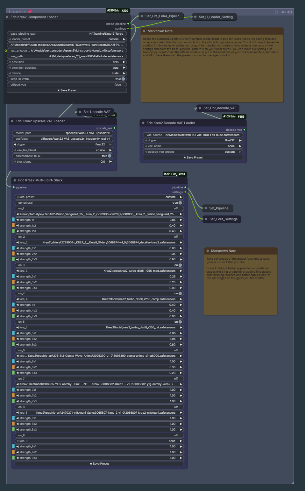
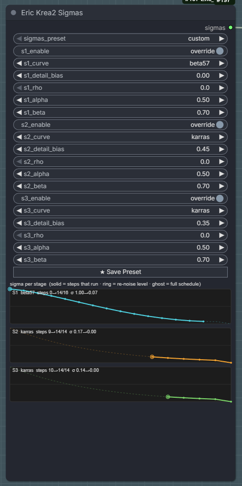
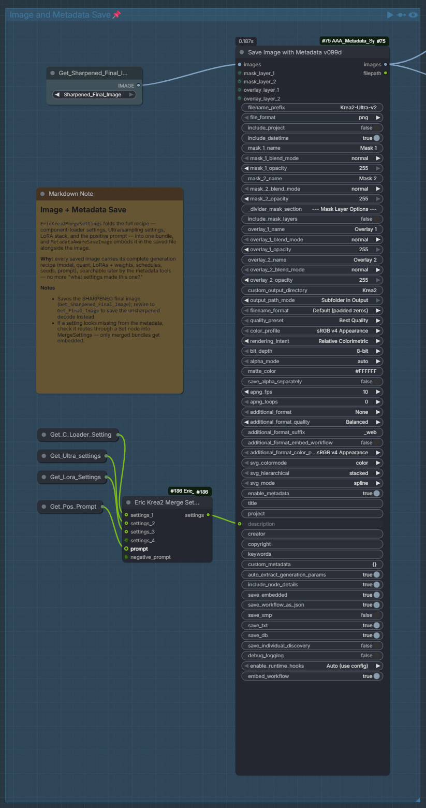
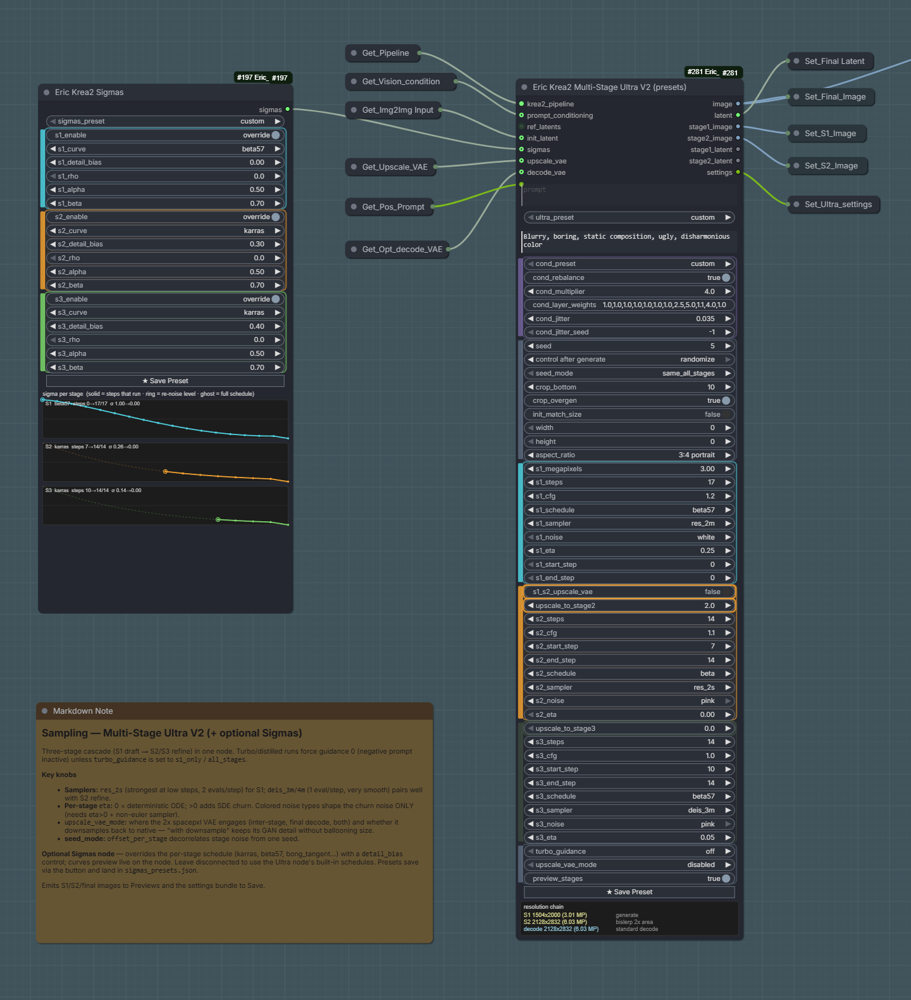
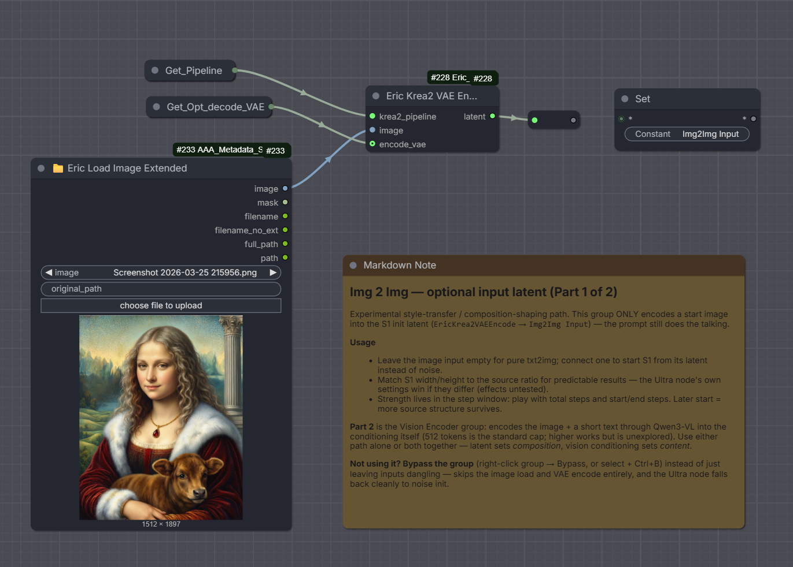
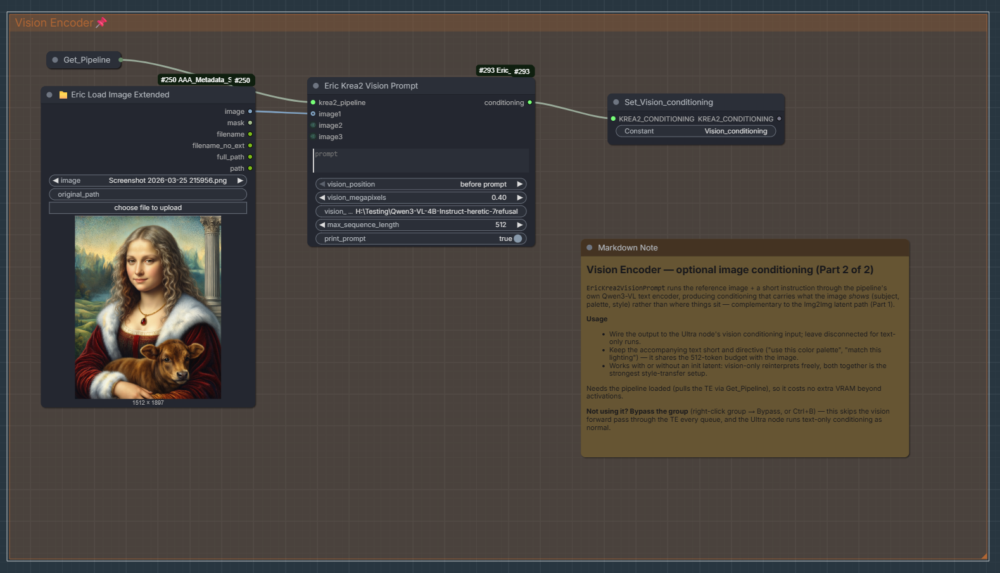

# Eric_Krea2

Self-contained ComfyUI custom nodes for **Krea 2** - Krea AI's open-weight,
from-scratch image model (single-stream MMDiT, flow matching, Qwen3-VL
conditioning). Includes text-to-image, progressive multi-stage high-res
generation, a 2× upscale-decode trick, and natural-language prompt tooling.

No dependency on any other node pack.

## Why Eric_Krea2 - key advantages

- **Real diffusers pipeline, not a reimplementation.** Runs the genuine Hugging
  Face `Krea2Pipeline` (single-stream MMDiT, flow matching, Qwen3-VL conditioning)
  loaded straight from weights - so you inherit upstream behaviour, fixes and the
  correct trained prompt templates, with no reverse-engineered sampling loop to
  drift out of sync.
- **Easy, honest multi-stage high-res.** Up to 3 progressive stages in one node,
  with per-stage samplers, schedules, guidance and re-noise windows, plus an
  on-node resolution-chain readout so you always see the real S1→S2→S3→decode
  sizes.
- **First-class img2img.** A VAE Encode node feeds an `init_latent` input; denoise
  strength is just the stage's re-noise step window - no separate float to guess.
- **Reference-image style/content grounding (Vision Prompt).** Ground conditioning
  in 1-3 reference images through Krea2's *own* Qwen3-VL vision path - a "prompt
  from a picture" effect (semantic style/content grounding, not pixel editing) with
  no training and none of the silently-discarded-reference pitfalls of the common
  community pattern. Composes freely with img2img for structure + content on
  separate channels.
- **Presets everywhere.** Named JSON presets per section (loader / LoRA / Ultra /
  sigmas) with a ★ Save button, a Merge Settings node, and Settings-from-Image for
  one-click reproduction of a saved image's recipe.
- **LoRA with per-stage settings + presets.** Apply / unload / diagnose plus a
  Multi-LoRA Stack - *both* with per-stage weights (S1/S2/S3), so a LoRA can steer
  composition harder than final detail (or vice-versa) within a single multi-stage
  run, and *both* with named-preset save/load (★ Save) for one-click recall.
- **Reference-latent edit pathway.** With an edit-trained LoRA loaded, a Reference
  Latents node feeds VAE-encoded reference images through the ai-toolkit
  "index_timestep_zero" method - real pixel/structure conditioning (distinct from
  Vision Prompt's semantic grounding), reimplemented against our diffusers transformer.
- **Custom flow-matching samplers, no external solver.** `res_2m`, `res_2s`,
  `deis_3m`, `deis_4m` re-implemented from the RES/DEIS papers, selectable per
  stage, with schedule + `detail_bias` control.
- **Two high-res strategies for two checkpoints.** Turbo → fast 4k via the 2×
  upscale-decode; Raw → controlled multi-stage re-denoise - plus optional
  downsample "quality-pass" VAE modes that are usually cleaner than the Wan 2.1 VAE
  at the same size.

## What's New

**July 2026 - multi-stage sampling, presets & img2img toolkit.**

- **Custom flow-matching samplers** - `res_2m`, `res_2s`, `deis_3m`, `deis_4m`
  re-implemented from the RES/DEIS papers (no external solver import), selectable
  per stage. Recommended: `res_2s` + `beta57` for the Stage-1 draft, `deis_3m` /
  `deis_4m` + `bong_tangent` for the refine passes.
- **Shared schedule library + Sigmas node** - `linear`, `balanced`, `karras`,
  `beta57`, `beta`, `bong_tangent`, `exponential`, with a per-stage `detail_bias`
  control driven from a dedicated **Sigmas** node.
- **img2img** - a **VAE Encode** node plus an `init_latent` input on the
  Multi-Stage node; denoise strength is set by the re-noise step window.
- **Vision Prompt** - image-grounded conditioning via Krea2's own Qwen3-VL vision
  path (no training, no VAE/reference-latent pathway needed). Auto-shares its
  megapixel budget across however many reference images are connected. See
  [Vision Prompt](#vision-prompt-image-grounded-conditioning).
- **Resolution & latent helpers** - a **Resolution** node (aspect+MP or
  image-derived size → `width`/`height`/blank latent) and a latent-space
  **Latent Resize** (bislerp, no VAE round-trip).
- **Presets & settings** - named JSON presets per section (loader / component loader /
  Apply LoRA / LoRA stack / Ultra / sigmas) with a ★ Save button, a **Merge Settings**
  node, and **Settings from Image** for one-click reproduction.
- **LoRA tooling** - apply / unload / diagnose plus a **Multi-LoRA Stack**, both with
  **per-stage weights** (S1/S2/S3) and named-preset save/load (★ Save).
- **Reference Latents (edit LoRAs)** - a **Reference Latents** node VAE-encodes 1-3
  reference images into the ai-toolkit "index_timestep_zero" edit pathway, fed via a new
  optional `ref_latents` input on the Multi-Stage Ultra (res) node. Works *only* with an
  edit-trained LoRA loaded (e.g. the Krea 2 Style Reference LoRA on Turbo at guidance 0);
  the base model can't read reference tokens. See
  [Reference Latents](#reference-latents-edit-lora-image-conditioning).
- **Upscale VAE quality-pass modes** - the trained spacepxl Wan 2× decoder can drive
  the S2→S3 jump and/or the final decode, each with a **downsample** variant that keeps
  its sharp detail but resamples down to your chosen size instead of forcing 4× area.
  The `… with downsample` modes are usually **cleaner/sharper than the Wan 2.1 VAE** at
  the same output size and avoid the resolution blow-up. An on-node **resolution-chain
  readout** shows the real S1→S2→S3→decode sizes and flags any field the VAE overrides.
  See [Upscale VAE: modes & precedence](#upscale-vae-modes--precedence).

*Initial release (June 2026):* Krea 2 Raw + Turbo support, multi-stage high-res,
2× upscale-decode, selectable attention backend, natural-language prompt builder +
LLM Magic-Prompt expander.

## Requirements

These nodes drive the **genuine Hugging Face `Krea2Pipeline`** directly (see
[key advantages](#why-eric_krea2---key-advantages)); the only hard requirement is a
diffusers/transformers build new enough to expose it.

- A **diffusers** build that includes `Krea2Pipeline` (merged after `0.39.0.dev0`):

  ```
  python_embeded\python.exe -m pip install --upgrade --force-reinstall --no-deps git+https://github.com/huggingface/diffusers.git
  ```

  The version string stays `0.39.0.dev0`, so `--force-reinstall` is required to
  pull the newer commit.
- A `transformers` new enough to provide `Qwen3VLModel`.
- Krea 2 weights in diffusers layout (e.g. `H:\Training\Krea-2-Raw` and
  `H:\Training\Krea-2-Turbo`).
- *Optional, recommended on Blackwell:* FlashAttention and/or SageAttention for
  the faster `attention_backend` paths.
- *Optional:* the spacepxl Wan 2× upscale VAE (auto-downloaded on first use).

## Example workflow


A single, multi-purpose graph lives in [workflows/](workflows/). **Drag
`example-workflow.png` onto the ComfyUI canvas** (the graph is embedded in the
PNG metadata) to load the whole pipeline at once - loaders, txt2img, img2img,
Vision Prompt, per-stage sampling, and the metadata-aware save. Flip parts on/off
with group **bypass** (Ctrl+B) instead of juggling separate workflows. See
[workflows/README.md](workflows/README.md) for the group-by-group breakdown.

## Nodes

### Core generation

| Node | Does |
|------|------|
| **Eric Krea2 Loader** | Loads `Krea2Pipeline` (Raw or Turbo), applies `attention_backend`, caches in VRAM. Auto-detects `is_distilled`. Preset dropdown. |
| **Eric Krea2 Generate** | Text-to-image. Emits `IMAGE` + a chainable `KREA2_LATENT`. `auto_settings` picks 8/0 for Turbo, 28/4.5 for Raw. |
| **Eric Krea2 Multi-Stage Ultra (res)** | Up to 3-stage progressive high-res with the custom RES/DEIS samplers, per-stage schedules, img2img `init_latent`, an optional `ref_latents` edit input, and `width`/`height` overrides. Best on Raw. |
| **Eric Krea2 Multi-Stage Ultra V2 (presets)** | Preset-driven variant of the Ultra node - serialises every widget (incl. `sigmas`, `width`/`height`) into one reproducible recipe. |



*The loader group - the Component Loader (with `loader_preset`), the Upscale and Decode VAE loaders, and the growable Multi-LoRA Stack with per-stage strengths. Each carries its own ★ Save Preset button.*

### Sampling & scheduling

| Node | Does |
|------|------|
| **Eric Krea2 Sigmas** | Per-stage schedule overrides (S1/S2/S3): curve, `detail_bias`, Beta α/β. Emits a `KREA2_SIGMAS` bundle the Ultra nodes fold in. |



*The Sigmas node: per-stage curve / `detail_bias` / Beta α-β overrides with a live sigma preview per stage (solid = steps that run, ring = re-noise level, ghost = full schedule).*

Samplers (per stage, on the Ultra node): `euler`, `res_2m`, `res_2s`, `deis_3m`,
`deis_4m`. Schedules: `linear`, `balanced`, `karras`, `beta57`, `beta`,
`bong_tangent`, `exponential`. See [Samplers & schedules](#samplers--schedules).

### img2img, resolution & latents

| Node | Does |
|------|------|
| **Eric Krea2 VAE Encode** | Encodes an `IMAGE` → `KREA2_LATENT` (the img2img primitive). |
| **Eric Krea2 Reference Latents (Edit)** | VAE-encodes 1-3 reference images → `KREA2_REF_LATENTS` for the Ultra (res) node's `ref_latents` input (ai-toolkit "index_timestep_zero" edit method). **Needs an edit-trained LoRA** to do anything; the base model ignores reference tokens. See [Reference Latents](#reference-latents-edit-lora-image-conditioning). |
| **Eric Krea2 Resolution** | Size from `aspect_ratio` + `megapixels` or a source image → `width`/`height`/`dims` + a blank `KREA2_LATENT` (noise or zeros). |
| **Eric Krea2 Latent Resize** | Resize a `KREA2_LATENT` in latent space (bislerp, no VAE round-trip): `scale` / `dimensions` / `megapixels`. |
| **Eric Krea2 Latent → ComfyUI LATENT** | Bridge a `KREA2_LATENT` to a stock ComfyUI `LATENT`. |

### Decode

| Node | Does |
|------|------|
| **Eric Krea2 Upscale VAE Loader** | Loads the spacepxl Wan 2× upscale decoder → `UPSCALE_VAE`. Optional `downsample_to_1x` + `blur_sigma`: decode at 2× then Lanczos-downsample back to native size - a supersampling-style quality pass instead of a literal resolution gain. Travels with the loaded VAE into every consumer (see [Upscale VAE: modes & precedence](#upscale-vae-modes--precedence)). |
| **Eric Krea2 Decode VAE Loader** | Loads a plain decode VAE. |
| **Eric Krea2 Upscale Decode (2×)** | Decodes a `KREA2_LATENT` via the upscale VAE (no re-denoise). Resolution and any downsample/blur are whatever the loaded `UPSCALE_VAE` was configured with. |
| **Eric Krea2 VAE Decode** | Plain 1× decode of a `KREA2_LATENT`. |

### Presets, LoRA & utilities

| Node | Does |
|------|------|
| **Eric Krea2 Merge Settings** | Merges section recipe strings into one `KREA2_SETTINGS` (dicts updated, `lora` lists concatenated). |
| **Eric Krea2 Settings from Image** | Reads an image's embedded generation settings back into a `KREA2_SETTINGS` recipe. |
| **Eric Krea2 Component Loader** | Loads pipeline components with a preset dropdown. |
| **Eric Krea2 Apply LoRA** / **Unload LoRA** / **Diagnose LoRA** | Apply, cleanly remove, and inspect LoRA adapters on the cached pipeline. Apply LoRA supports **per-stage weights** (`per_stage_weights` + `weight_s1`/`weight_s2`/`weight_s3`) so a LoRA's strength can differ across S1/S2/S3 in a multi-stage run, plus a **preset dropdown** (`apply_lora_preset` + ★ Save). |
| **Eric Krea2 Multi-LoRA Stack** | Stack several LoRAs in one growable node - each slot has **per-stage weights** (`strength_Ns1`/`s2`/`s3` for S1/S2/S3) and an on/off toggle, plus a shared `ephemeral` switch and a **preset dropdown** (`lora_preset` + ★ Save). Unused rows auto-hide until needed. |
| **Eric Krea2 Unload Models** | Free VRAM on demand. |
| **Eric Krea2 Save Latent (debug)** | Save/inspect a packed latent for debugging. |



*Reproducibility: Merge Settings folds the loader + Ultra + LoRA + prompt recipes into one bundle that gets embedded in the saved PNG - readable back later via Settings from Image.*

### Prompting

| Node | Does |
|------|------|
| **Eric Krea2 Prompt** | Assembles structured fields into a dense, comma-joined natural-language prompt; quotes text-to-render. |
| **Eric Krea2 Magic Prompt** | Expands a short prompt via a local LLM (LM Studio / Ollama / any OpenAI-compatible endpoint). |
| **Eric Krea2 Vision Prompt** | Grounds conditioning in 1-3 reference images via Krea2's own Qwen3-VL vision path, using Krea2's *trained* descriptor template (not the generic Qwen-Image-Edit template). Emits `KREA2_CONDITIONING` → Ultra's `prompt_conditioning` input. See [Vision Prompt](#vision-prompt-image-grounded-conditioning) below. |

## Samplers & schedules

Each stage of the Multi-Stage Ultra node picks a **sampler** (the ODE solver) and a
**schedule** (the sigma spacing) independently.



*A full sampling group - the Sigmas node feeding Multi-Stage Ultra V2, with per-stage samplers/schedules, guidance, re-noise windows, and the on-node resolution-chain readout.*

**Samplers**

| Sampler | Order | Model calls / step | Best for |
|---------|-------|--------------------|----------|
| `euler` | 1 | 1 | Baseline / A-B tests. Always runs to σ=0 (ignores a noisy early stop). |
| `res_2m` | 2 (multistep) | 1 | General use - sharper than Euler at the same cost. |
| `res_2s` | 2 (single-step) | 2 | Low step counts / Stage-1 draft. Self-starting; ~2× slower. |
| `deis_3m` | 3 (multistep) | 1 | Smooth refine passes. |
| `deis_4m` | 4 (multistep) | 1 | Smoothest refine at higher step counts. |

All non-Euler solvers honour a *noisy early-stop* (`end_step < steps`), letting a
stage hand a partially-denoised latent to the next, and support the ancestral
`eta` SDE path. The math is recreated from the RES (arXiv:2308.02157) and DEIS
(arXiv:2204.13902) papers - no external solver code is imported.

**Schedules:** `linear`, `balanced`, `karras`, `beta57`, `beta`, `bong_tangent`,
`exponential`. The **Sigmas** node adds a `detail_bias` knob (biases sigma spacing
toward fine detail vs. large structure) and Beta α/β shaping.

**Recommended pairings** (per the RES4LYF community):
- **Stage 1 (draft):** `res_2s` + `beta57`.
- **Stage 2/3 (refine):** `deis_3m` or `deis_4m` + `bong_tangent`.

### Choosing a sampler per stage: warmup & accuracy

Two independent properties decide which solver fits a stage. They often point in
opposite directions, so it's worth understanding both rather than just copying the
pairings above.

**1. Multistep warmup (order build-up).** Multistep solvers (`res_2m`, `deis_3m`,
`deis_4m`) reach their rated order by fitting a polynomial through *past* steps, so
they start low-order and ramp up:

| Step in the run | `deis_3m` effective order |
|-----------------|---------------------------|
| 1st | 1 (Euler-like) |
| 2nd | 2 |
| 3rd onward | 3 (full) |

Crucially, **each stage restarts the solver** - the history buffer is empty at the
stage boundary and does *not* carry across the re-noise handoff. So the ramp is
measured from the first step of *that stage's* run, not the global step index. A
Stage-3 run of `steps=14, start=7, end=14` is **7 sampling steps**, of which the
first ~2 are below full order (full 3rd order from its 3rd step ≈ global step 9).
`deis_4m` ramps over ~3 steps and needs even more runway. Sub-order steps aren't
"wrong" - they're just Euler/2nd-order accurate - but at low step counts the warmup
eats most of the run and the higher order never pays off.

`res_2s` is **self-starting** (a self-contained predictor+corrector, 2 model calls
per step) - full order from step 1, no warmup - which is why it wins when steps are
scarce. Cost balances out because you use fewer of them: `res_2s` @ 4 steps = 8
calls ≈ `deis_3m` @ 7 steps = 7 calls, but cleaner at the low count.

**2. Trajectory smoothness (from-noise vs from-clean).** This is why Stage 1 uses a
single-step solver even though it has plenty of steps to amortize warmup:

- **Stage 1 starts from pure noise** (σ≈max). The early high-σ steps are where the
  model's x₀ prediction is roughest and swings hardest step-to-step, *and* where
  global composition is decided. Multistep solvers extrapolate a polynomial through
  those past predictions, so rough/rapidly-changing history risks **overshoot/ringing
  exactly where structure is set**. `res_2s` doesn't rely on history, so it's robust
  on that rough start, and its corrector buys accuracy on the most consequential
  steps of the whole pipeline.
- **Stages 2/3 start from an already-clean latent** (low-mid σ, smooth trajectory).
  Here the multistep history is reliable, so `deis_3m`'s cheap high-order
  extrapolation genuinely shines.

**Putting it together:**

| Stage | Trajectory | Steps | Pick | Why |
|-------|-----------|-------|------|-----|
| S1 draft | from noise | long | `res_2s` | robustness on the rough start > cheap order |
| S1 draft (cost-saving) | from noise | long | `res_2m` | multistep middle ground: 1 call/step, some early robustness given up |
| S2/S3 refine | from clean | long (≥~8-10) | `deis_3m` | smooth trajectory + cheap order; warmup amortized |
| S2/S3 refine | from clean | very long, smooth schedule | `deis_4m` | marginal extra accuracy once there's runway |
| S3 light refine / no upscale | from clean | few | `res_2s` | self-starting - no warmup waste when steps are scarce |

Rules of thumb: **from noise → self-starting (`res_2s`)**; **from clean + many steps
→ multistep (`deis_3m`/`4m`)**; **from clean + few steps → back to `res_2s`** (no
warmup to waste). `deis_4m` only over `deis_3m` on long, smooth, high-step runs; it's
more prone to overshoot on short or noisy-early-stop stages.

## img2img



*img2img (Part 1): a start image is VAE-encoded into the S1 `init_latent`. Denoise strength lives in the step window; the prompt still does the talking. Bypass the group for pure txt2img.*

```
Load Image → Eric Krea2 VAE Encode → (init_latent) Multi-Stage Ultra
                     └→ Eric Krea2 Resolution (image) → width/height → Multi-Stage Ultra
```

Stage 1 re-noises the `init_latent` at `s1_start_step` and denoises the
`[s1_start_step, s1_end_step]` window - so **denoise strength is the step window**,
not a separate float. Feed `width`/`height` from the Resolution node (or turn on
`init_match_size`) to size Stage 1 to the source image.

## Vision Prompt (image-grounded conditioning)



*Vision Prompt (Part 2): a reference image + a short instruction run through Krea2's own Qwen3-VL vision path → `KREA2_CONDITIONING`. Sets content/style; pairs with img2img for structure.*

```
Load Image(s) -> Eric Krea2 Vision Prompt -> (prompt_conditioning) Multi-Stage Ultra
```

Pushes 1-3 reference images through Krea2's own text encoder's vision path (it's a
Qwen3-VL VLM, not text-only), so the resulting conditioning is visually grounded by
those images - a "prompt from a picture" effect - without training anything and
without the pitfalls of the community pattern of reusing the core
`TextEncodeQwenImageEditPlus` node for this: that node's VAE-encoded reference goes
nowhere (the *base* Krea2 DiT has no reference-latent pathway - `Krea2.extra_conds`
never reads reference_latents, so it's silently discarded; an edit-trained LoRA is what
adds one, exposed separately via the
[Reference Latents](#reference-latents-edit-lora-image-conditioning) node), and it falls
back to Qwen3-VL's generic image-description template once an image is attached instead of the
descriptor template Krea2 was actually conditioned with. This node has no VAE step at
all (nothing to discard) and always uses Krea2's own `prompt_template_encode_prefix`/
`_suffix`, read straight off the loaded pipeline so it can't drift out of sync.

**This is semantic grounding, not pixel editing.** With no reference-latent pathway of
its own it gives no structure/identity preservation from the image alone - for that,
pair it with img2img (below): img2img supplies structure (what to start denoising from),
Vision Prompt supplies content (what to draw toward). They're independent channels
into the transformer and compose freely, including with different source images
for each. (If you have an edit-trained LoRA, the
[Reference Latents](#reference-latents-edit-lora-image-conditioning) node adds a third,
pixel-level channel.)

**Positive-conditioning only.** Steering *toward* a reference makes sense; steering
*away* from one is a much stranger ask, and Turbo (the primary target) mostly runs
`cfg=0` anyway - no negative pass to feed. When `prompt_conditioning` is connected,
Ultra's own `prompt` field is entirely inert (not used, not logged) - put your text in
the Vision Prompt node's own `prompt` field instead. `cond_rebalance` still applies to
it, identically to a text-only encode.

**Token budget - the one thing to know before your first run.** Krea2 was trained
with a *fixed* 512-token text budget (prefix + images + prompt, always padded/
truncated to exactly this length) - unlike Qwen-Image's dynamic per-batch padding,
which is why Qwen-Image tolerates a much higher `max_sequence_length` more gracefully.
One full-resolution (1 MP) reference image alone is ~988 tokens - nearly double the
whole budget before your prompt or even the 34-token prefix. To keep this workable
out of the box, the node auto-shares a ~0.40 MP budget across however many images you
connect (1 image ≈ 0.40 MP, 2 ≈ 0.20 MP each, 3 ≈ 0.13 MP each) and raises a clear,
specific error - with a suggested `vision_megapixels` value - rather than silently
truncating into the image-token block (which corrupts position ids and crashes deep
inside `get_rope_index` with a cryptic shape-mismatch instead). `vision_megapixels` is
a ceiling on top of the auto-share, not a replacement for it - lower it to reserve more
room for a long prompt.

## Reference Latents (edit-LoRA image conditioning)

```
Load Image(s) -> Eric Krea2 Reference Latents -> (ref_latents) Multi-Stage Ultra (res)
```

A second, *pixel-level* way to condition on a reference image - complementary to
[Vision Prompt](#vision-prompt-image-grounded-conditioning)'s semantic grounding. Each
reference image is VAE-encoded and flow-packed exactly like a generation latent, then its
tokens are appended to the image sequence and modulated at **t = 0** (clean data) - the
ai-toolkit "index_timestep_zero" edit method. The velocity prediction is sliced back to
the live image tokens, so the references only *inform* the denoise, they aren't denoised
themselves.

**Requires an edit-trained LoRA.** The base Krea2 model was never trained to read these
tokens - this pathway only does something useful with an ai-toolkit `krea2` edit LoRA
(`model_kwargs.edit: true`) loaded, e.g. the Civitai **Krea 2 Style Reference LoRA**.
Without one, the reference tokens are appended but effectively ignored (and you just pay
their compute cost - ~2048 tokens per 1 MP ref, per denoise step).

**Recommended wiring** (matches the Style Reference LoRA's training setup):
- the reference image(s) → **Reference Latents** (`max_ref_megapixels` 1.0) → `ref_latents`;
- the *same* image(s) → **Vision Prompt** (`vision_megapixels` ≈ 0.15) → `prompt_conditioning`;
- the edit LoRA in the **Multi-LoRA Stack** at strength 1.0;
- **Turbo** checkpoint at **guidance 0**.

**CFG caveat.** The transformer-forward wrapper can't tell a positive pass from a negative
one, so with guidance enabled the references condition *both* passes and partially cancel
in the CFG delta. Keep it on Turbo at `g = 0` (which is what the published edit LoRAs
target anyway). This is an independent diffusers-side reimplementation of the published
mechanism (mechanism credit: ostris / ai-toolkit), not a port.

## Two high-res strategies

Krea 2's two checkpoints suit two different paths:

**Turbo → fast 4k (no re-denoise).** Turbo is distilled (8 steps, guidance 0) and
resists partial re-denoise, but the 2× decode sidesteps that entirely:

```
Loader (Krea-2-Turbo) → Generate (2048², auto) → [Upscale VAE Loader] → Upscale Decode 2× → 4096²
```

**Raw → controlled high-res (multi-stage).** Raw keeps the full-CFG,
resolution-aware trajectory that partial re-denoise needs:

```
Loader (Krea-2-Raw) → Multi-Stage Ultra (1024² → 2× → 2×) → 4k image  (+ optional Upscale Decode 2× → 8k-class)
```

## Upscale VAE: modes & precedence

On the Multi-Stage Ultra node, `upscale_vae_mode` (requires `upscale_vae` connected)
governs the **S2→S3** jump and the **final decode**. Each transition can be a plain
2× VAE step (real resolution gain, 4× area) or a **downsample** variant that keeps the
upscale decoder's sharp/GAN-trained detail but resamples down to your chosen size:

| Mode | S2→S3 | Final image |
|------|-------|--------------|
| `disabled` | bislerp latent resize | `decode_vae` (or the base Qwen VAE if none connected) |
| `s2-s3` | **upscale VAE** 2× (4× area; ignores `upscale_to_stage3`) | `decode_vae` / base |
| `s2-s3 with downsample` | **upscale VAE** 2× → downsample to `upscale_to_stage3` | `decode_vae` / base |
| `final decode` | bislerp latent resize | **upscale VAE** 2× |
| `final decode with downsample` | bislerp latent resize | **upscale VAE** 2× → downsample to native |
| `both` | **upscale VAE** 2× (4× area) | **upscale VAE** 2× |
| `both with downsample` | **upscale VAE** 2× → downsample | **upscale VAE** 2× → downsample to native |
| `both with final decode downsample` | **upscale VAE** 2× (4× area) | **upscale VAE** 2× → downsample to native |

> **Recommended: prefer the `… with downsample` variants.** In practice the upscale
> VAE decoded at 2× *then* resampled down is cleaner and sharper than the Wan 2.1 VAE
> at the same output size - you get its detail without the literal 4× area blow-up (and
> without the re-encode softening compounding across stages). The plain `s2-s3` / `both`
> modes force 4× area and **ignore** `upscale_to_stage3`, which is the usual cause of a
> run ballooning to 20 MP+; the downsample variants respect your numeric factor instead.

The old `inter_stage` / `final_decode` values still load (aliased to `s2-s3` /
`final decode`) so existing graphs keep working.

**S1→S2 has its own switch.** `s1_s2_upscale_vae` (a separate boolean) routes the
*first* jump through the upscale VAE and forces 2× (4× area), overriding
`upscale_to_stage2`. It's deliberately not in the dropdown - using the VAE that early is
a specialist move (the re-encode softening gets refined away by S2/S3). Combining it
with a `both …` mode is what cascades to enormous final sizes - watch the on-node
**resolution chain** readout, which shows the real S1→S2→S3→decode sizes and flags every
field the VAE is overriding.

**`decode_vae` is ignored outright for the final image whenever the mode does a VAE
final decode** (`final decode*` or `both*`) - not blended, not overridden, simply not
passed to that call at all. It still governs the **stage preview** images
(`preview_stages=True` → `stage1_image`/`stage2_image`) regardless of what the final
image uses, since previews always go through `standard_decode(..., decode_vae=decode_vae)`
independent of `upscale_vae_mode`. So: want the upscale VAE for your final image but a
specific grain/texture VAE for previews? Keep both connected - they don't conflict.
Want the upscale VAE and don't care about previews? `decode_vae` can stay disconnected
with no effect either way.

**Two ways to get the downsample quality pass on the final decode.** The mode's
`… final decode downsample` variants request it per-run; the Upscale VAE Loader's own
`downsample_to_1x` toggle bakes it into the loaded VAE for *every* consumer (including
the standalone Upscale Decode node). Either enables the same thing - decode at 2× then
Lanczos-downsample back to native, a supersampling-style pass rather than a literal
resolution gain. `blur_sigma=0` is a good default (Lanczos already anti-aliases); raise
it only as a taste knob. Inter-stage (S2→S3) downsampling reads the mode flags, not the
loader boolean.

## Turbo guidance & the negative prompt

Turbo is distilled for guidance 0, so most wrappers give you no CFG - and therefore no
**negative prompt** - on the Turbo checkpoint. Multi-Stage Ultra re-enables it. The
`turbo_guidance` dropdown decides where classifier-free guidance (and the negative pass
it needs) is allowed on a distilled model:

| `turbo_guidance` | S1 | S2 | S3 |
|------------------|----|----|----|
| `off` *(default)* | g = 0 | g = 0 | g = 0 |
| `s1_only` | uses `s1_cfg` | forced g = 0 | forced g = 0 |
| `all_stages` | `s1_cfg` | `s2_cfg` | `s3_cfg` |

- **Guidance convention** is Krea's `g`, where standard **CFG = 1 + g** (`g=0` → CFG 1.0,
  `g=0.2` → CFG 1.2). Turbo was distilled for `g=0`, so keep it low (**~0.1-0.3**); the node
  warns above `g=1.5` (Raw-level, over-saturates Turbo).
- **The negative prompt is only active on a stage whose `g > 0`.** Under `off` it is inert.
- Each guided stage runs a second (uncond) pass, so it is **~2× slower** for that stage -
  which is why `s1_only` exists: put guidance + negatives on the composition, then let
  S2/S3 refine fast and single-pass (it force-zeros `s2_cfg`/`s3_cfg` for you - you don't
  set them yourself).

Using a real negative prompt on a distilled/Turbo checkpoint at all is unusual - most
Turbo pipelines simply can't feed one.

## Notes

- **Raw vs Turbo:** Raw is the undistilled base - *train LoRAs on Raw, run on
  Turbo*. Raw is the right choice for multi-stage re-denoise; Turbo for the fast
  decode path.
- **Shared VAE:** Krea 2 uses `AutoencoderKLQwenImage` (16-channel, f8), identical
  to Qwen-Image and Wan2.1 - which is why the spacepxl 2× decoder is a drop-in.
- **Prompting:** Krea 2 wants natural language (not JSON/tags). Long, dense
  visual/material/camera descriptions work best; quote words to render as text.
  For best expander fidelity, download Krea's `expansion.txt` and point the Magic
  Prompt node's `system_prompt_path` at it.

## Credits & licenses

- **Krea 2** by Krea AI - weights under the Krea 2 Community License.
  https://github.com/krea-ai/krea-2
- **Upscale VAE:** spacepxl/Wan2.1-VAE-upscale2x (Apache-2.0).
  https://huggingface.co/spacepxl/Wan2.1-VAE-upscale2x
- **Samplers:** the RES and DEIS solvers are independent re-implementations of the
  published algorithms - RES (arXiv:2308.02157) and DEIS (arXiv:2204.13902) -
  specialised to rectified flow. Sampler/schedule choices were informed by the
  [RES4LYF](https://github.com/ClownsharkBatwing/RES4LYF) community; no RES4LYF or
  k-diffusion code is imported.
- **Vision Prompt:** informed by [ethanfel/ComfyUI-Krea2TextEncoder](https://github.com/ethanfel/ComfyUI-Krea2TextEncoder),
  which first identified that Krea2's Qwen3-VL text encoder can be vision-grounded
  and that the community pattern of reusing `TextEncodeQwenImageEditPlus` for this
  wastes a silently-discarded reference latent and uses the wrong prompt template.
  This is an independent implementation built directly against the installed
  diffusers/transformers source, not a port of that node's code.
- **Reference Latents (edit):** the \"index_timestep_zero\" reference method is credited
  to ostris / ai-toolkit (the Krea2 edit-LoRA training recipe) and
  [ostris/ComfyUI-Krea2-Ostris-Edit](https://github.com/ostris) for the ComfyUI-core
  implementation. This is an independent diffusers-side reimplementation verified
  line-by-line against the installed `transformer_krea2.py`, not a port.
- **Nodes:** Eric Hiss (GitHub: EricRollei).

These nodes are an independent implementation; no code is copied from Krea or
spacepxl repos.
